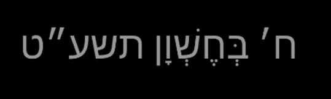

# Module: MMM-JewishDate
The `MMM-JewishDate` module is module of the MagicMirror.
This module displays the current Jewish date.



## Using the module

To use this module, add it to the modules array in the `config/config.js` file:
````javascript
modules: [
	{
		module: "MMM-JewishDate",
		position: "top_left",	// This can be any of the regions.
		config: {
			// There is no config currntly. will added 
		}
	}
]
````

## Configuration options
TODO..
